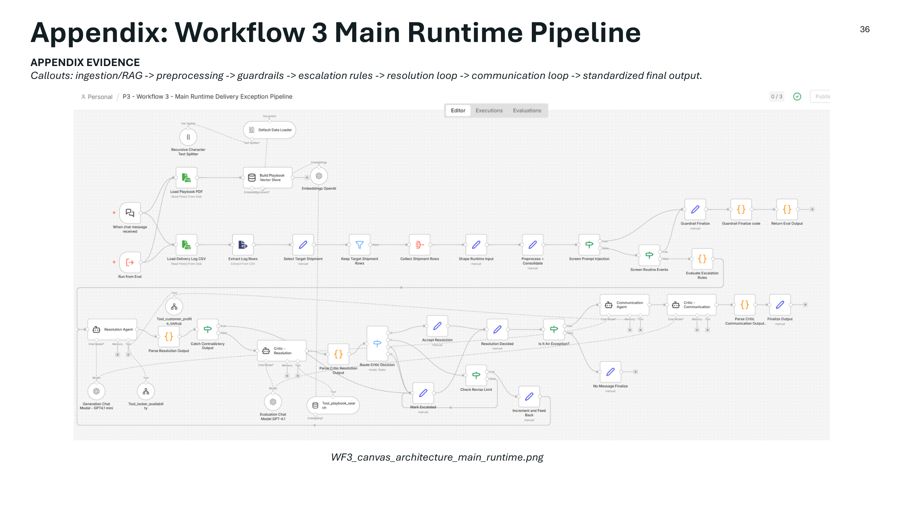

# Architecture Overview

## Architectural Pattern

The solution uses a modular, four-workflow architecture in n8n. Two workflows operate as callable tools, one workflow operates as the main runtime pipeline, and one workflow operates as the evaluation harness.

This structure separates data retrieval, runtime reasoning, and evaluation so that each layer can be tested and maintained independently.

## Workflow 1: Customer Profile Lookup

**Purpose:** provide customer context to the agents while controlling personally identifiable information.

The workflow accepts a customer identifier and a PII flag. By default, the workflow redacts the customer name and returns only operationally relevant fields such as tier, preferred channel, recent exception count, and active credit. When the communication agent needs personalization, it can request the profile with PII enabled.

**Design value:** this keeps customer data access separate from agent reasoning and supports safer data handling.

## Workflow 2: Locker Availability

**Purpose:** determine whether a package can be rerouted to a locker.

The workflow checks locker availability by ZIP code, capacity status, maximum package size, and package-size compatibility. It returns an eligibility flag, selected locker information when available, and an explanatory reason when the locker path is unavailable.

**Design value:** deterministic locker rules prevent the LLM from inventing locker eligibility or promising an infeasible pickup path.

## Workflow 3: Main Runtime Pipeline

**Purpose:** execute the end-to-end exception handling process.

Major stages include:

1. **Entry and ingestion:** supports manual chat entry and programmatic evaluation entry.
2. **Playbook ingestion and RAG:** loads the playbook PDF, splits text, embeds chunks, and builds an in-memory vector store.
3. **Log loading and preprocessing:** loads delivery log rows, selects the target shipment, consolidates duplicate/multi-row events, and extracts ZIP code.
4. **Guardrails:** screens prompt-injection patterns and routine non-exception events before agent execution.
5. **Escalation rules:** computes deterministic automatic or discretionary escalation signals.
6. **Resolution loop:** uses a Resolution Agent and Critic-Resolution checker to classify the event and approve, revise, or escalate the decision.
7. **Communication loop:** uses a Communication Agent and Critic-Communication checker to generate and validate customer messaging.
8. **Finalization:** emits standardized output fields for downstream evaluation.

## Workflow 4: Evaluation Harness

**Purpose:** run the main pipeline over test cases and compute evaluation metrics.

The workflow loads ground-truth labels, builds canonical shipment-level test cases, runs the main pipeline for each shipment, applies a coherence judge, combines predictions with ground truth, and calculates aggregate metrics.

## Agentic Design

The agentic portion follows a maker/checker pattern:

| Layer | Maker | Checker | Outcome |
|---|---|---|---|
| Resolution | Resolution Agent | Critic-Resolution | Validated classification, resolution, escalation status, and rationale |
| Communication | Communication Agent | Critic-Communication | Validated customer-facing message, tone, and next step |
| Output | Parsers and finalization nodes | Evaluation harness | Standardized output for metrics and observability |

## Governance Design Choices

- Deterministic rules are used for strict escalation conditions.
- LLM agents are used for interpretation, synthesis, and message generation.
- Critic agents validate outputs before finalization.
- Structured output parsing reduces downstream ambiguity.
- Routine/no-exception cases bypass the agent loop to reduce unnecessary processing.
- PII is exposed only where required for customer communication.

## Architecture Diagram

See the main runtime pipeline image:

