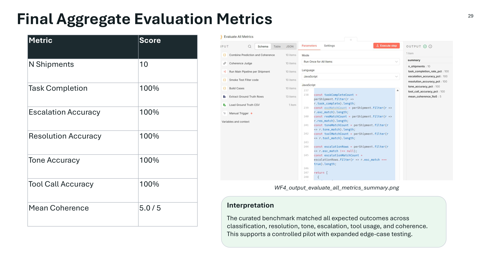

# Evaluation Results

## Evaluation Objective

The evaluation harness measures whether the delivery exception pipeline produces the expected shipment-level outcome for each test case. The evaluation focuses on observable outputs rather than hidden reasoning.

## Metrics

| Metric | Result |
|---|---:|
| Shipment-level test cases | 10 |
| Task completion | 100% |
| Escalation accuracy | 100% |
| Resolution accuracy | 100% |
| Tone accuracy | 100% |
| Tool call accuracy | 100% |
| Mean reasoning coherence | 5.0 / 5 |

## What Was Evaluated

Each shipment was evaluated across the following dimensions:

- exception classification match
- resolution match
- communication tone match
- escalation match where applicable
- tool call accuracy
- task completion
- reasoning trajectory coherence

## Test Case Coverage

| Shipment | Scenario | Expected Outcome | Result |
|---|---|---|---|
| SHP-001 | Routine delivered | No exception / N/A | PASS |
| SHP-002 | VIP second failed attempt | Reschedule / formal / escalate | PASS |
| SHP-003 | Address issue | Reschedule / casual / no escalation | PASS |
| SHP-004 | Damaged fragile VIP package | Replace / formal / escalate | PASS |
| SHP-005 | Third failed attempt with locker path | Reroute to locker / casual / escalate | PASS |
| SHP-006 | Refused delivery | Return to sender / casual / no escalation | PASS |
| SHP-007 | Perishable five-hour weather delay | Replace / formal / escalate | PASS |
| SHP-008 | Standard customer with repeated failed attempts | Reschedule / casual / discretionary escalation | PASS |
| SHP-009 | Damaged perishable package | Replace / formal / escalate | PASS |
| SHP-010 | Routine depot scan | No exception / N/A | PASS |

## Interpretation

The benchmark result indicates that the workflow matched all expected outcomes in the curated 10-shipment proof-of-concept dataset. The result supports continued pilot testing and broader validation, but it should not be interpreted as production readiness.

## Production Readiness Considerations

Before production use, the system would need:

- larger and more diverse test sets
- edge-case and adversarial testing
- live delivery feed integration
- access control and secrets management review
- human-in-the-loop review paths
- monitoring for model drift and policy drift
- cost, latency, and reliability benchmarking
- customer-impact governance and audit controls

## Evaluation Evidence

See the final metrics screenshot:

